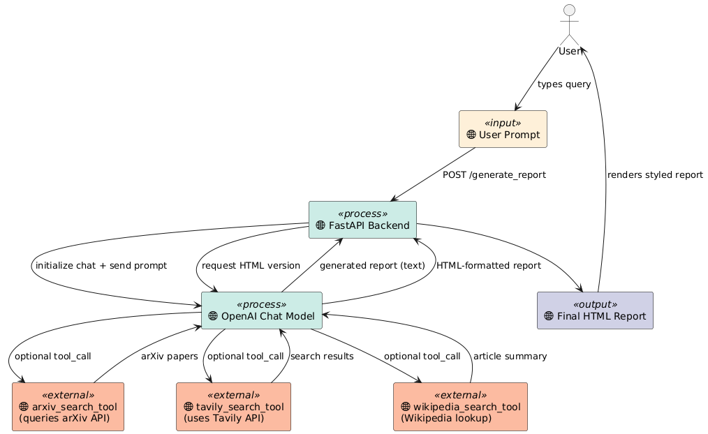

# 🤖 Agentic AI Patterns - DeepLearning.AI Course

> *Master the art of building intelligent, autonomous AI agents with Andrew Ng's comprehensive course on Agentic Design Patterns*

## 🎯 Course Overview

This repository contains the complete coursework, lab assignments, and practical implementations from **DeepLearning.AI's Agentic AI Course** taught by Andrew Ng. Learn to build sophisticated AI agents that can plan, reflect, use tools, and collaborate to solve complex real-world problems.

## 📚 Module Structure

### 🔄 [Module 2: Reflection Design Pattern](./M2%20Reflection%20Design%20Pattern/)
**Master self-improving AI systems through iterative critique and refinement**


- **Core Concept**: AI systems that critique and improve their own outputs
- **Key Projects**:
  - 📊 **Visualization Agent**: Creates and refines data visualizations through LLM feedback
  - 🃏 **Flashcard Generator**: Improves study materials through pedagogical reflection
  - 🔒 **PII Protection**: Defensive reflection for healthcare AI security
  - 💾 **SQL Agent**: Self-correcting database query generation

### 🛠️ [Module 3: Tool Usage Design Pattern](./M3%20Tool%20Usage/)
**Empower AI agents with external tools and function calling capabilities**



- **Core Concept**: Extending AI capabilities through strategic tool integration
- **Key Technologies**: OpenAI Function Calling, AISuite, MCP (Model Context Protocol)
- **Key Projects**:
  - 📧 **Email Agent**: Complete email management with FastAPI integration
  - 🔍 **Research Agent**: Web search and academic research automation
  - 🗄️ **SQL Agent**: Database interaction and schema exploration tools

### 🎯 [Module 4: Practical Tips for Building Agents](./M4%20Practical%20Tips%20for%20Building%20Agents/)
**Production-ready strategies for robust AI agent development**


- **Core Concept**: Real-world implementation patterns and evaluation strategies
- **Focus Areas**:
  - 📈 **Agent Evaluation**: Gold standard creation and F1-score tracking
  - 🔧 **Hyperparameter Optimization**: Search engine and result tuning
  - 🏗️ **Production Patterns**: Scalable architecture design

### 🤝 [Module 5: Multi-Agent Collaboration](./M5%20Patterns%20for%20Highly%20Scalable%20Agents/)
**Orchestrate multiple specialized agents for complex problem solving**

- **Core Concept**: Dividing complex tasks across specialized agent teams
- **Collaboration Patterns**: Sequential orchestration, concurrent dialogues, fault-tolerant automation
- **Key Projects**:
  - 🛍️ **Customer Service Pipeline**: Four-agent system (Planner → Coder → Executor → Reflector)
  - 📝 **Research Team**: Specialized roles for research, writing, and critique

## 🚀 Production-Ready Implementation

### [Reflective Research Agent](./agentic-ai-public/)
**Full-stack FastAPI application demonstrating production agentic patterns**

**Tech Stack**: FastAPI, PostgreSQL, Docker, Jinja2, Tavily API, arXiv API, Wikipedia API

**Features**:
- 🔄 **Multi-step Planning**: Intelligent research workflow orchestration
- 🔍 **Tool Integration**: Tavily search, arXiv papers, Wikipedia lookup
- 📊 **Real-time Tracking**: Live progress monitoring via WebSocket
- 🗄️ **State Persistence**: PostgreSQL for task management and results
- 🌐 **Web Interface**: Clean UI for research task initiation

**Quick Start**:
```bash
# Build and run the complete research agent
docker build -t fastapi-postgres-service .
docker run --rm -it -p 8000:8000 -p 5432:5432 --env-file .env fastapi-postgres-service

# Access the application
open http://localhost:8000
```

## 🎨 Key Workflow Visualizations

### Chart Generation with Reflection


*Demonstrates iterative improvement: Initial code → Execution → Critique → Refinement → Final output*

### Research Agent Architecture


*Shows tool orchestration: User Query → Planning → Tool Selection → Execution → Report Generation*

## 💡 Learning Outcomes

After completing this course, you'll master:

- 🧠 **Agentic Design Patterns**: Reflection, Tool Use, Planning, Multi-agent coordination
- 🔧 **Production Implementation**: FastAPI services, database integration, containerization
- 📊 **Evaluation Strategies**: Creating benchmarks, tracking performance metrics
- 🛡️ **Security Patterns**: PII protection, defensive reflection, prompt injection prevention
- 🤖 **Agent Orchestration**: Sequential and parallel agent coordination

## 🛠️ Prerequisites

- Python 3.8+
- Docker & Docker Compose
- OpenAI API Key
- Tavily API Key (for web search)

## 📖 Course Structure

Each module contains:
- 📹 **Video Content**: Comprehensive explanations of design patterns
- 🧪 **Ungraded Labs**: Hands-on practice with guided implementation
- ✅ **Graded Labs**: Assessment-ready projects with solution guides
- 📝 **Documentation**: Detailed README files and architectural diagrams

## 🎓 About the Instructor

**Andrew Ng** - Co-founder of Coursera, former Director of Stanford AI Lab, and pioneer in online education. This course represents the cutting-edge of agentic AI development, distilling years of research into practical, implementable patterns.

---

*Ready to build the next generation of intelligent agents? Start with Module 2 and work through the progression of increasingly sophisticated agentic patterns.* 🚀
